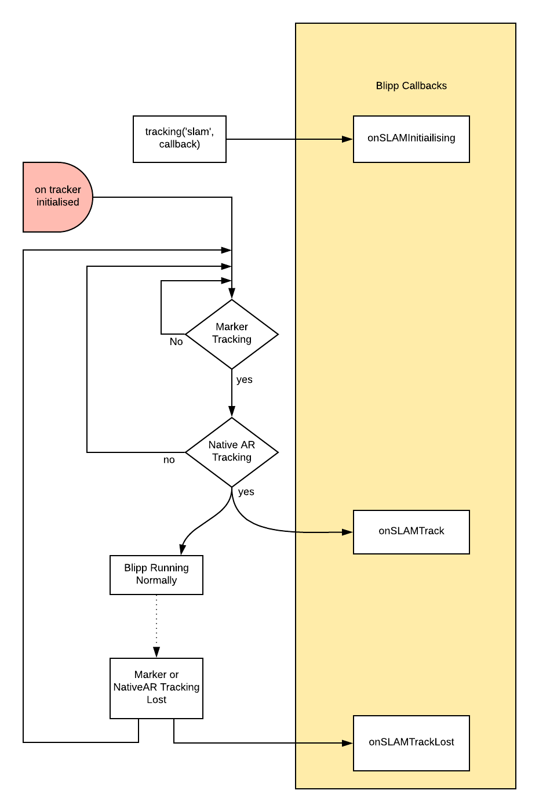

# Marker-based SLAM Tracking

With the traditional marker-based tracking whenever the camera loses sight of the target, tracking is lost and the blipp would 'peel' to the screen. SLAM tracking allows tracking to be maintained even when the target is lost in the camera view. It uses a combination of ARKit/ARCore and the device sensors to keep track of the position and orientation of the target relative to the device. Tracking also happens in real world coordinates, allowing a developer to place items to scale in their surroundings. To see a quick and basic demo video of it in operation see [here](../../assets/SLAM-demo-short.mp4).

## Requirements

See [dependencies](native-ar-prerequisites.md) document for more.

### Glossary

* `Native AR`: ARKit and ARCore frameworks on iOS and Android

## How to Enable SLAM Tracking

By default the normal marker tracker is enabled. To activate SLAM tracking you need to call `scene.setTracking` with a value of `'slam'`.

Alignment with [horizon mode](#horizon-lock) is the default.  If `'slamNoHorizonLock'` is used then this mode will be disabled and the Native AR coordinate space will follow the marker orientation when tracked. This is very useful for static markers and when you do not need the gravity alignment.

When horizon lock mode is used the system will eliminate small errors in the alignment of the marker, keeping the scene aligned with the real world.

The BlippBuilder script notification function will be called if there are problems initialising. Starting the tracker takes some time, it is recommended in this time to display some sort of loading indicator, especially on Android as it can take several seconds.

This BlippBuilder script should always use this callback because errors are likely since Native AR support is not guaranteed.

The possible Native AR failures are:

* `SDK_NOT_INSTALLED` - The ARCore SDK isn't installed
* `SDK_TOO_OLD` - The ARCore SDK installed is too old
* `SDK_INSTALL_DECLINED` - The user has declined to install the ARCore SDK
* `DEVICE_NOT_COMPATIBLE` - The device is not compatible with Native AR
* `OS_NOT_SUPPORTED` - The device is supported but the OS is not supported
* `APK_TOO_OLD` - The ARCore SDK APK is too old (only valid when sideloading the ARCore APK)

Below is an example of the SLAM command:

    scene.setTracking("slam", function(result, reason) {
        switch (result) {
            case 'OK':
                console.log("SLAM initialised ok");
                break;
            default:
                console.log("Unable to initialise SLAM with error: " + reason);
                break;
        }
    });

## Horizon Lock

By default Blippar SLAM aligns your world with gravity.  This minimises problems if the printed marker is not perfectly straight on the wall (or whereever it may be).  Without this feature, tiny alignment errors of your printed marker would mean your AR world would look like it was on a hill and would get worse the further away from the marker it was.

You can observe this feature by running your slam blipp and then twisting your marker up or down; you will observe that the alignment of the scene remains locked to the real world.  

This mode helps make sure that the world aligns with the real world well, this may not be what is required and it can be disabled using `scene.setTracking('slamNoHorizonLock'....)`

### Physical Based Markers

Traditionally in Blippar marker space operated in pixel space. That is, the blipp coordinate space was defined by the dimensions of the marker in pixels.

SLAM operates in real-world coordinate system. Therefore if SLAM is to be used alongside a marker, the SDK needs to know the physical characteristics of the marker such as it's size in world unit space. See the [Scaling](#scaling) section for more.

If the automatic marker proximity system is enabled then it also needs to know the position and facing direction of the markers too.

### New Marker Attributes

The marker tracker uses pixels for configuring the world coordinate space. The SLAM tracker requires the coordinate space to be in real world coordinates. The blipp needs to tell indicate what the dimensions, position and orientation of the marker(s) are.

#### Marker Attributes

    blipp.getMarker().setPhysicalFacingDirection([0, 0, 1]);
    blipp.getMarker().setPhysicalSize([333, 258]);
    blipp.getMarker().setUnits('mm');

#### marker.setPhysicalFacingDirection( [dx,dy,dz] )

Sets the physical facing direction of a marker.  This is always relative to the primary marker detected which is considered to have a facing direction of [0,0,1]

The axes are relative to the orientation of the initial triggering marker, therefore:

* `dx` is the left-to-right axis of the initial marker, where negative is to the left, and positive is to the right
* `dy` is the vertical axis, when positive is up, and negative is down
* `dz` is the axis pointing away from the camera towards the initial marker, where positive is towards the device and negative moving away

#### marker.setPhysicalSize( [w,h] )

Sets the physical size of a marker in world unit space, i.e. the printed object.  This is critical for the scaling to work correctly.  When the physicalSize attribute is set the marker automatically switches into world unit space mode which means that any objects attached to this marker will be sized and positioned using world unit space AND NOT marker pixels (which is the Blippar default)

#### marker.setUnits( mm OR pixels )

Sets the unit mode for objects attached to this marker. Blippar uses marker pixels by default but can be switched to real world unit space when using SLAM.  The system will automatically set to world unit space when the physicalSize attribute is used.

The [above code](#marker-attributes) sets the primary marker to be facing outwards towards the camera and has a size of 333x258mm.

### Tracking Failures

It is possible for the SLAM tracker to either partially or completely lose tracking during normal operation of the blipp.

Limited or lost tracking occurs in the following scenarios:

* The device is moving too quickly.
* There is insufficient features in the camera image.
* During limited tracking the SLAM system remains functional but drift accumulates quickly, moving geometry away from where it should be in the real world.

Lost tracking can occur in the following scenarios:

* Systemic failure of the Native AR systems due to resource exhaustion or other environmental or VIO issues
* Backgrounding and foregrounding of the app can cause the SLAM system to have a really poor tracking on return. It is highly likely that the drift will be substantial, especially if the user has moved the device while in the background

In this scenario the blipp is notified about the lost tracking and the best option is to ask the user to re-track the marker to correct the system again.

The blipp receives a number of notifications regarding the status of the SLAM system:

### SLAM Callbacks

    scene.onSLAMTrack = function() {
        // SLAM tracking is locked on
        // Ok to show associated SLAM models/geometry
    };
    
    scene.onSLAMInitialising = function() {
    // The system is initialising, maybe display a loading indicator to the user
    };
    
    scene.onSLAMLost = function () {
        // SLAM tracking is lost, inform the user to re-acquire a marker
        // Hide SLAM models/geometry
    };

* onSLAMInitialising: Called when the system is initialising, this can take some time so it is a good idea to display a loading indicator.
* onSLAMTrack: Called when the SLAM system is in normal tracking mode
* onSLAMLost: Tracking has been lost, it can only be re-acquired if a user re-tracks the marker image. All SLAM models should be hidden in this call.

## Blipp Developer: How to use Blippar SLAM

### Designing a scene

When you are designing a Blipp for Blippar SLAM you need to think about things in a slightly different way.  When using SLAM, the AR environment you are creating will be projected into the real world and not just to an image marker.

A Blippar SLAM scene is very much like a normal blippar scene except that positions and sizes of all your objects are in real-world unit space (e.g. mm), not marker pixels.

You can design a scene where objects can be anywhere, including behind, above and below you.

### Triggering a Blipp

Blipps are still triggered off a marker.  The marker is essentially the root or anchor of your scene.  You should design you environment such that the marker will be in a specific and exact position in the real world.  You can then arrange for objects to be in the correct relative position to that marker.

The coordinate axes and orientation of world around the marker is relative and are based on the orientation of the initial triggering marker where the initial marker is assumed to be facing the device camera with a facing direction of (0,0,1)  It is not related to any physical axis such as a compass.  It is up to you to set up your world and environment so it matches your real environment.  If `dx` is left-right, `dy` is up-down, `dz` is towards-away from device, therefore a facing direction of (-1,0,0) would be facing to the left (with respect to the triggering marker) and (1,0,0) would be facing to the right etc.  

### Scaling

In order for the tracking systems to work correctly, Blippar needs to know the relationship between the size of the marker and the real world size of the printed image therefore you must provide two critical pieces of information:

* Marker image size in pixels.  This is set automatically for your initial triggering marker, (but can also be set with `addMarker` for other secondary markers)
* Marker physical size in world unit space (set with marker.physicalSize)
  
Once you have set the marker's physical size in your Blipp, you cannot change it or the printed marker without making sure the numbers match.  You must coordinate with your clients to make sure that the printed markers WILL ALWAYS match the physical size set in the blipp otherwise the world will not fit correctly

### Enabling Blippar SLAM for a simple case

As a very simple example, to enable SLAM in your blipp for a single marker you need at least:

1. A call to `scene.setTracking('slam', completion)` command and wait for the completion function to tell you all is well
2. Set the marker physical size with blipp.getMarker().setPhysicalSize([w,h]);
3. Add `scene.onSLAMTrack` and `scene.onSLAMLost` callbacks so you can observe issues if the system looses SLAM lock. It is recommended that you hide all geometry when SLAM tracking is lost and display UI to the user to re-acquire a marker.

### Drift

Like any image processing technology, ARKit/ARCore are not perfect.  They need really good detail and definition in the camera images to get a good lock.  In practice the lock drifts significantly over time so the alignment of your AR world will appear to move.  Each time the device sees your image marker then it will reposition and lock on correctly, but the longer it remains turned away from the marker, the further it will drift out of alignment.

This drift is largely out of our control, but hopefully in time Apple and Google will improve their tracking technologies and reduce drift.

In order to minimise drift make sure your real world environments have plenty of detail... (just like if you were designing a marker) flat whitewashed walls are not good!

### Blippar SLAM State Machine

The following diagram illustrates how the the Blippar marker image tracker and the Native AR tracker are used together to provide seamless tracking and shows the JS callbacks that are triggered under different conditions

In summary:

* When the system starts, it will be triggered by a marker, then it will wait for a good marker tracking lock and a Native AR alignment lock with the real world.  Once both of these are achieved the system will be generating good tracking.
* When the user moves the device the AR world will track as normal and if the marker tracking is dropped then the system will use the Native AR lock to estimate where the marker should be so that the scene continues to track.
* If the marker tracking and SLAM tracking both are lost then the system will notify the blipp and return to the initial waiting state where it will remain until both the marker and Native AR locks are restored.
* It is recommended that when SLAM tracking is lost that all geometry that depends on slam tracking is hidden. Otherwise it will remain floating in the last known position or orientation tracked.

The key point here is that the system will continue to draw and track the AR world as long as the Native AR is locked even if the marker tracking gets lost.  The user can turn completely around and things will still be held in place (see the section on drift)